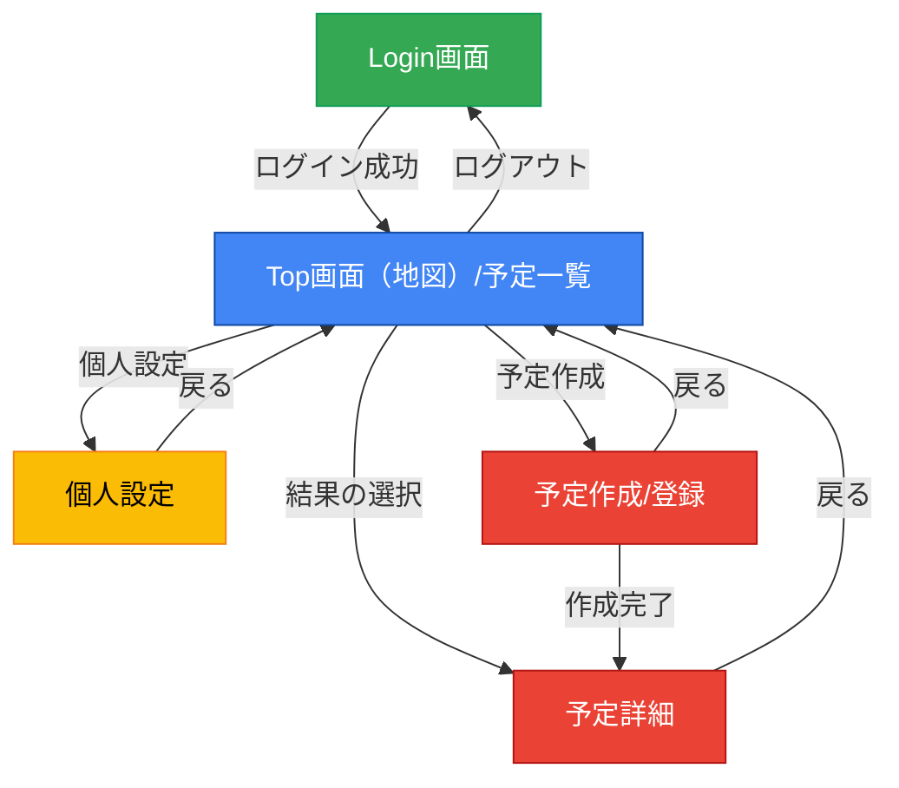

```mermaid
graph TD
    %% 画面遷移図

    %% ラベル定義
    Login[Login画面]
    Top[Top画面（地図）/予定一覧]
    Profile&Settings[個人設定]
    Details[予定詳細]
    Creation[予定作成/登録]
    
    %% 画面遷移定義
    Login -->|"ログイン成功"| Top
    
    Top -->|"個人設定"| Profile&Settings
    Top -->|"結果の選択"| Details
    Top -->|"予定作成"| Creation
    Top -->|"ログアウト"| Login
    
    Profile&Settings -->|"戻る"| Top

    Creation -->|"戻る"| Top
    Creation -->|"作成完了"| Details
    
    Details -->|"戻る"| Top
    
    %% Styling
    classDef primary fill:#4285F4,stroke:#0D47A1,color:white;
    classDef secondary fill:#34A853,stroke:#0F9D58,color:white;
    classDef warning fill:#FBBC05,stroke:#F57F17,color:black;
    classDef danger fill:#EA4335,stroke:#B31412,color:white;
    
    class Top primary;
    class Login secondary;
    class Profile&Settings warning;
    class Details,Creation danger;
```